# Crackme

## 002-abexcm5

尝试运行程序，发现有弹窗字符串，根据text strings referenced定位代码


可以看到相等跳转指令`je`正好跳过了中间的报错代码，也就是说要让eax和0x0相等


往上翻两行可以看到有两个固定的字符串在做拼接和比较(cat、cmp)，1111111是我们输入的字符串不用管。在4010CF处下断点再运行一遍。


运行到进cmp之前，是我们输入的字符串与`L2C-57816784-ABEX`在进行比较，答案也就找到了。


## 003-Cruehead-CrackMe-3

上来一个空白界面啥也没有，人蒙了。视频看了个开头，得知是keyfile类型的题目，需要读取密钥文件。又回去读了代码，发现需要CRACKME3.KEY文件来解密


然后将4021A0处的值与0x12进行了cmp，4021A0的值被注释为pBytesRead，即读取的字节数。于是在密钥文件内写入了12个1，但是没有明显变化，进行一个视频的看。


有人傻了，0x12是18个字节，改了之后发现写入的1作为函数参数被压栈了，进函数看一眼。


这一段是一个小加密，每次读1个字节的数据与初始值为0x41的bl异或，之后bl自增并将读的那个字节加到0x4020F9地址中。直到bl达到0x4F，也就是读14个字节后结束。


出函数后将0x4020F9地址的值与0x12345678异或，然后将这个值和eax中剩下的四个字节数据进行比较，一致即可。


流程上应该算是搞懂了，写注册机花了半天，好在终究是写出来了。

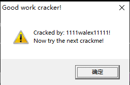

注册机：

```python
import binascii
# 加密过程
# data = '3131313131313131313131313131'
# serial = ''
# b = 0x41
# for i in range(0, len(data), 2):
#     hexdata = eval('0x' + data[i:i+2])
#     hexdata = hexdata ^ b
#     b += 1
#     serial += str(hex(hexdata)[2:])
# print(serial)

# 输入长度需要14位，否则需补齐，懒得写了
name = input('<<').encode('UTF-8').hex()
serial = 0x00
final_name = ''
b = 0x4E
for i in range(len(name)-1, 0, -2):
    hexdata = eval('0x' + name[i-1:i+1])
    serial += hexdata
    hexdata = hexdata ^ b
    b -= 1
    final_name = str(hex(hexdata)[2:]) + final_name

serial ^= 0x12345678
final_serial = ''
# 小端序，要倒着写进去，至少折腾了半个小时，菜
for i in range(2, len(hex(serial)), 2):
    final_serial = hex(serial)[i:i+2] + final_serial
final_serial = final_name + final_serial
print(final_serial)
```


## 004-Acid Bytes.2

能看出是upx加壳，但是字符串搜不到，没啥思路，看一眼视频。

````
脱壳方法：pushad后esp变动，右键CPU窗口的esp下硬件断点，F9运行后F8。右键analysis选项删除分析，还原乱码。右键->用ollydebug脱壳调试进程，保存exe文件
# 经验证win10无效
````

先看下一题


## 005-Andrnalin.1

尝试运行程序，按照弹窗的字符搜索字符串定位到代码附近。


往上翻一点有个je跳转，效果是把success部分跳过，那目标也就明确了，


方法1：je指令修改为jne指令(84改85)

方法2：继续向上发现了一个cmp函数的压栈操作，两个参数分别是ecx寄存器的值和固定的字符串


下断点运行之后可以发现ecx就是我们输入的字符串，直接比较。


**vb正确的返回值不是1，而是-1**


## 006-ArturDents-CrackMe#2

搜索字符串，找到了一个"You did it"，跟进去看看。重点在[ebx]和dl的cmp上。


**GetDlgItemTextA:从控件中取参的函数**

这里把用户名和序列号都取出来了，分别放进了eax寄存器和ebx寄存器中。对eax所存地址处的值逐字符放进dl，减去cl，再与ebx相同位置的值作比较，最后cl自减。

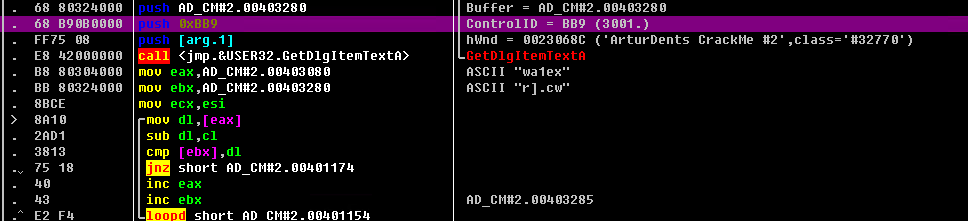


注册机：

```python
def crackme6():
    name = 'wa1ex'
    serial = ''
    cl = 0x5
    for i in name:
        temp = chr(ord(i) - cl)
        serial += temp
        cl -= 1
    print(serial)
```


## 007-reg

运行后多了一个dll文件，没找到切入点，看视频。通过智能搜索来搜索字符串，定位到大体的判断代码。通过参数压栈调用函数的参数，判断序列号对比是在哪个函数中进行的。


方法1：je指令修改为jne指令(74改75)

方法2：进算法call后修改初始化堆栈的操作如下：

```
mov eax,1
retn
```

方法3：往下跟进，将日期和用户名压栈并执行函数后，ecx获取到了一串字符串。可以猜测日期和用户名是序列号的生成要素，因此猜测生成的字符串即为序列号。


破解成功，确实是该字符串。


**看下来发现，我对着一些无关紧要的点消耗了过长的时间，以及对于寄存器和栈帧之间的操作不敏感。例如下面的lea指令，在这三个汇编指令运行后，edx中会得到call里面计算出的地址，在栈帧中查看该地址可以省下跟进函数中查看的时间，对进一步分析往往有很大帮助。**


## 008-Afkayas.1

根据字符串搜索，然后因为没有找到函数的精确位置，就往上翻了几十行下了个断点。


连着push了三个参数后，call了edi处的strcat函数。


效果是把0x00401B70处的AKA-和ecx里的487774连起来了。


下面紧跟了一个strcmp，猜测这个就是序列号。


猜想正确。


要写注册机主要是要搞清楚这个487774是哪里来的。

以下代码输出了这个487774：首先获取了字符串长度并乘上0x17CFB，再加上首字符的ascii码值，最后通过vbaStrI4函数将前面的结果转换为了487774。在python中可以通过encode函数实现这个转换。


注册机：

```python
def crackme8():
    name = 'walex'
    length = len(name)
    temp = 'AKA-' + str(str(length * 0x17CFB + ord(name[0])).encode())[2:-1]
    print(temp)
```


## 009-Boonz-KeygenMe#1

**DialogBoxParamA:主界面函数**


根据报错提示，搜索Bad Boy字符串。这里直接看到了一个cmp和je跳转，决定了破解的结果。


往上翻到401208位置，第一次出现了用户名wa1ex，并进行了第一段变形。


第二段变形。


第三段变形。


这几个变形结果被cat函数连了起来，得到了一个很像序列号的字符串。


验证成功。


注册机：

```python
def crackme9():
    name = 'wa1ex'
    serial = 'Bon-'
    mutli = 0xffffffff
    limit = mutli + 1
    ebx = 0
    for i in name:
        eax = ord(i)-0x19
        ebx -= eax
    ebx = limit + ebx
    serial = serial + hex(ebx)[2:].upper() + '-'

    eax = (ebx * ebx) & mutli
    ebx = (ebx * eax) & mutli
    serial = serial + hex(ebx)[2:].upper() + '-'

    eax = ebx = ecx = 0x40E0F8
    ecx = (ecx * ebx) & mutli
    ecx -= eax
    serial = serial + hex(ecx)[2:].upper()
    print(serial)
 
```


## 010-ceycey

很怪，完全跑不动的代码，不知道是不是因为加壳的问题。（有猪栈平衡法断点下错位置了）

找到OEP后dump出来，出现如下报错，据ede的说法是需要重建IAT表。


重建过程中遇到两个问题，一个是RVA为5B604的地方并未找到函数名，一个是在ImpREC软件中右键无效函数时并未跳转到该函数的代码中。


## 011-wocy.1

搜索字符串。


方法1：jnz改jz（75改74）

方法2：往上拉一段打断点，一路F8，发现输进来的字符串在40164D里reverse了一次。


终。


## 012-ACG-crcme1

去除nag：搜索字符串，函数参数push处断点，查看调用栈追溯如下。方式：jnz改jmp或更改cmp中的0x1。


此处对用户名进行了一系列操作，把结果存到了eax中入栈。


紧接着开始操作输入的系列号，成功的条件是eax最终等于0，因此可以倒推到4012CD处。剩下的问题就是如何将输入的数，经过4012A8到4012CB的变换，得到我们需要的数。


经过尝试后发现，变换前后的结果是一致的，问题迎刃而解了。


如图


注册机：

```python
def crackme12():
    name = 'wa1ex'
    serial = '123456'
    al = 0
    for i in range(len(name)):
        bl = ord(name[i])
        al += bl
    temp1 = (al << 3) ^ 0x515A5

    # 字符串变整数
    # print(serial)
    # eax = 0xA
    # edi = 0
    # for i in range(len(serial)):
    #     bl = ord(serial[i]) - 0x30
    #     edi = eax * edi + bl
    # print(edi)
    # edi ^= 0x87CA
    # ebx = edi
    # eax = temp1 + ebx
    # eax ^= 0x797E7
    eax = 0x797E7
    ebx = eax - temp1
    edi = ebx
    edi ^= 0x87CA
    print(edi)
```


## 013-Acid burn

这题给我的感觉很奇怪，但ede说是很简单，一定是ede的问题。

nag：字符串搜索下断点到42F797处，发现这个call函数会弹窗，跟进


来到42A1A8处，查看调用栈，go


来到地址425643，发现了je指令，改为jmp并dump程序。


再次搜索失败后弹出的字符串，往上拉到42F998处下断点。一通找，在402771处发现了eax的进一步变化，离谱。


上面那行去掉，翻了一个小时的东西还是得推翻重来，悲。据ede一线嘲笑，eax * 0x29 * 2的实现代码在这个位置。由于在这个部分栈内没有出现9758的字符串，也没有乘2的mul，我就忽视了这部分，直接跟进到了栈中出现9758的函数里去，太痛苦了，我释放忍术。


下图位置引入了CW和CRACKED两个字符串，这里memory换成long->address with ascii dump更容易看一些


最后把以上连起来就是序列号


注册机：

```python
def crackme13():
    name = 'wa1ex'
    # temp1 = (ord(name[0]) << 3) - ord(name[0])
    # print(hex(temp1))
    # temp2 = (ord(name[1]) << 4)
    # temp1 += temp2
    # print(hex(temp1))
    eax = ord(name[0]) * 0x29
    eax *= 2
    serial = 'CW-' + str(eax) + '-CRACKED'
    print(serial)
```


## 014-Splish

一个nag、一个hardcode还有一个序列号

nag：加载中间按F12停住，查看栈调用没找到调用函数。调整栈窗口以EBP为基，找EBP+4的位置，跟过去把push和call全置成nop。


hardcode：搜索字符串定位到这一段打断点，403215是getwindowtextA获取到的输入，那401353处就是hardcode，结果进去一看是HardCoded，只能说确实挺hardcode的。


serial：用户名经过如下变换写入403258


序列号经过如下变换写入40324D


放大系数选6、7、8、10、11均可


注册机：

```python
def crackme14():
    name = 'wa1ex'
    ecx = 10
    ebx = 0
    serial = ''
    for i in name:
        edx = ((ord(i) % ecx) ^ ebx) + 0x2
        if edx > 0xA:
            edx -= 0xA
        ebx += 1
        edx += 6 * 0xA
        serial += chr(edx)
    print(serial)
    # for i in serial:
    #     edx = ord(i) % ecx
```


## 015-Brad Soblesky.1

硬编码


## 016-fty_crkme3

```
栈平衡法：首先F8，在ESP处打硬件断点，F9F8就到了OEP所在的位置，在该位置进行ollydebug的调试脱壳得到dump.exe。将该位置-0x400000填入import REC，获取IAT表并查找无效函数修改，转储到dump.exe中得到dump_.exe文件。终
```

看完了，回头写个感想：抽象，真的抽象。写那么长，看着贼麻烦，结果是不写循环的屑。

整个程序分成三部分：第一部分是输入字符串是否符合标准的检验；第二部分是把字符串的数字部分拼起来；第三部分是验证数字是否符合预期

第一部分：没啥好说的，要求字符串共9位，除第3、7位是-以外都是数字


第二部分：看一次中间的循环，从12-456-89中取单个字符，然后mov一个0x1作为字符串长度，call 40284C，然后把结果存到eax里

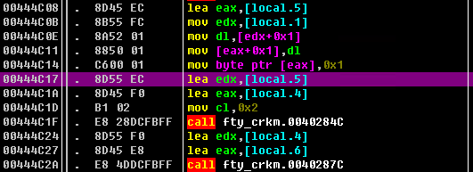

40284C：进来之后al和dl相加（字符串长度相加），和预期长度cl对比，一致的话就把字符拼到后面去。

444C2A：看着像个复制，没细看


结果：


第三部分：三个call，第一个call取出字符串中的一个数字，第二个没什么动静


第三个call 444B20：这个-2+1是真的乐9926315，imul 6次，即7次方，然后加回edi


最后cmp的是esi和edi，发现esi是在407B64处取的值，把字符串变成了数。


即：找到一个7位数，其每位的7次方和等于其本身。


注册机：

```python
def crackme16():
    serial = '12-456-89'
    total = 0
    for i in range(1000000, 9999999):
        current = i
        while current != 0:
            res = current % 10
            total += res ** 7
            current //= 10

        if total == i:
            print(str(i)[0:2] + '-' + str(i)[2:5] + '-' + str(i)[5:7])
        total = 0
        # 1741725
        # 4210818
        # 9800817
        # 9926315

```


## 017-Cabeca

本来极其简单的硬编码题目，因为我把十六进制转十进制的call错认成了加密的call，一层层的追进去细读，导致浪费了一个上午以及现在写文档的10分钟，淦。


序列号1、2是12506和178


## 018-crackme_0006

每次做题的时候很烦，做完了回头一看：不是**挺简单的吗，怎么花了这么长时间

如ede文档所说，此题的新奇之处在于以盘符作为local4生成的由来。对我而言还有一个初见的东西，就是通过idiv生成索引，再根据索引从硬编码的字符串中取值生成serial。

还有一点是在用wa1ex为用户名时，注册机正常运行；换成soundfuture之后，serial就错了，所以soundfuture真不行。好吧，其实是soundfuture由于比较长，在mul中用到了edx寄存器来存乘积的高位，而wa1ex用不着，并且我也确实不记得mul的这个定义了，对着ollydebug和python比对了半天才解决了问题。


```python
def crackme18():
    name = 'wa1ex'
    local1 = 'BA7069C6'
    local1_after_call = 'A71809C1'
    local2_after_call = '4E301383'
    # 根据盘符和一系列变换得到的local4
    local4 = 0x625FBB16
    eax = 1
    edx = 0
    for i in name:
        eax *= ord(i)
        if eax > 0xFFFFFFFF:
            edx = eax // 0x100000000
        else:
            edx = 0
        eax += edx
        eax &= 0xFFFFFFFF
        print(hex(eax))
    eax = rol(eax)
    eax |= local4
    eax &= 0xFFFFFFF
    key_402073 = '071362de9f8ab45c'
    serial = ''
    while eax != 0:
        ecx = 0x10
        index = eax % ecx
        serial += key_402073[index]
        eax //= 0x4
        print(eax)
    print(serial)
```


## 019-Acid Bytes.3

浪费感情。


## 020-cosh.3

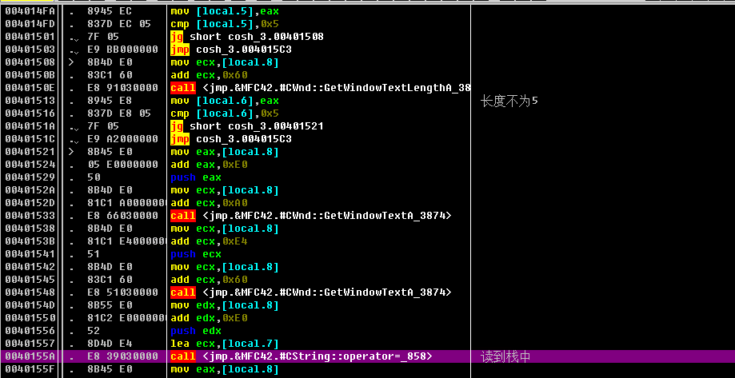

下面这段将用户名和密码分别进行了变形，变形完如果一致就通过。由于是xor异或，不需要细看实现，直接再次异或即可。


```python
def crackme20():
    raw_name = input("<<")
    name = ''
    cl = 1
    for i in raw_name:
        bl = ord(i)
        bl = cl ^ bl
        name += chr(bl)
        cl += 1
    print(name)

    cl = 0xA
    password = ''
    for i in name:
        bl = ord(i)
        password += chr(cl ^ bl)
        cl += 1
    print(password)
```


## 021-DIS[IP]-Serialme

比较指令的格式是：

```
CMP destination,source
```

其中，destination和source可以是寄存器，内存单元或立即数，但不能同时是内存单元。

比较指令会影响溢出、符号、零、进位、辅助进位和奇偶标志位。

如果比较的是两个无符号数，则零标志位和进位标志位表示的两个操作数之间的关系如下表所示：

| CMP结果               | ZF   | CF   | 含义 |
| :-------------------- | :--- | :--- | :--- |
| 目的操作数 < 源操作数 | 0    | 1    | 小于 |
| 目的操作数 > 源操作数 | 0    | 0    | 大于 |
| 目的操作数 = 源操作数 | 1    | 0    | 相等 |


唯一一个小问题是在`mov cx,[eax*2+0x40301A]`部分，在内存中读的两个字节在寄存器中会逆序，头疼的大小端。

试了一下，用户名最长五位，否则0x40301A处存在的不是输入的PASS，而是用户名。

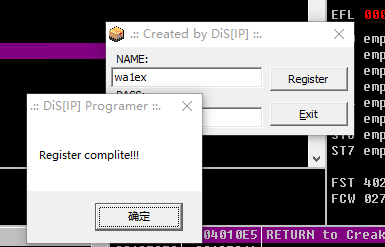

```python
def crackme21():
    raw_name = 'wa1ex'
    password = ''
    a = 0
    for i in raw_name:
        value = ord(i)
        if value == 0x5A:
            value -= 1
        if value == 0x7A:
            value -= 1
        if value == 0x39:
            value -= 1
        eax = 0x61 + a
        bl = value + 1
        bh = eax
        a += 1
        password += chr(bl) + chr(bh)
    print(password)
```


## 022-CM_2

jle指令是一种**条件跳转指令**，它用于在结果小于或等于（或不大于）时跳转到指定的地址。jle指令的格式是：

```
JLE label
```

其中，label是一个标号，表示要跳转的目标地址。

jle指令的结果受到cmp指令的影响，因为cmp指令会根据比较结果修改零标志位（ZF）、符号标志位（SF）和溢出标志位（OF）。

如果cmp指令比较的两个操作数相等，那么ZF会被置为1，此时jle指令会跳转到label处执行

如果cmp指令比较的两个操作数不相等，那么ZF会被置为0，此时jle指令会根据SF和OF的关系决定是否跳转。

如果SF和OF不相等，那么表示结果为负数，此时jle指令会跳转到label处执行。

如果SF和OF相等，那么表示结果为正数或零，此时jle指令不会跳转，而是继续执行下一条指令。

比如这里实现的效果是：不大于5跳转，即要求用户名密码均大于5


什么沙雕东西，嗯编码。


```python
def crackme22():
    password = '6287-A'
    
```


## 0023-TraceMe

从第四个字母（0x3）开始，每个字母乘一个特定的值，积的和就是序列号。


```python
def crackme23():
    raw_name = 'fatestede'
    esi = 0
    bl_list = [0x0c, 0x0a, 0x13, 0x09, 0x0c, 0x0b, 0x0a, 0x08]
    for i in range(3, len(raw_name)):
        dl = ord(raw_name[i])
        bl = bl_list[i-3]
        dl = dl * bl
        esi += dl
    print(esi)
```

肥逼ede！

在写下上面这段之后去看了ede的文档，发现我对这道题的认知还有很大的不足，原因在于我找到入口点的方式太碰巧了。我搜完字符串判断出这段没有check逻辑，直接往下拉了一段看到两个gettext，就很诡异的定位到了入口点，阳寿局。


## 024-reverseMe


创建Keyfile.dat文件，16个G即可。


## 025-CRC-32crackme

搜索字符串不能直接搜到。因此在输入错误的用户名/验证码后F12，Alt+K追溯调用函数，找到事发现场。


用户名前面加了`DikeN`，验证码前面加了`0`，对checkcode的变形就是字符串变整数，怪的是看不懂验证逻辑是什么。

看了半天倒是确定了验证逻辑就是esi和eax，但不知道esi是哪里来的，往上翻了一段发现在处理用户名的时候有一句`mov esi eax`，无语


esi是用户名串的地址，edi是内存中的固定地址`403E1A`，每个字符的低位都将乘4后以edi为基准进行一个ebx的赋值。但这个寻找的范围有点大，看ede的文档是装了个插件，注册机我直接摸。


## 026-KeygenMe

爷还没开debug，你在这骗鬼呢


简单看了一下是用户名变形去对应checkcode。出现了一个问题，我用户名变形完对应不到可输入字符。


硬来的时候忘了注意内存里排序的问题，又是tm20分钟没了，还想了半天。


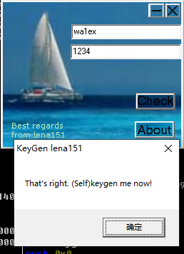

```python
def crackme26():
    name = 'wa1ex'
    esi = 0
    for i in name:
        edx = ord(i)
        ebx = edx
        ebx *= edx
        esi += ebx
        ebx = edx
        ebx //= 2
        ebx += 3
        ebx *= edx
        ebx -= edx
        esi += ebx
        esi *= 2
    # 底下这十六进制不全是可显示字符，无语子，真下头
    print(hex(esi)[0:2] + (10-len(hex(esi)))*'0' + hex(esi)[2:])
```


## 027-MexeliteCRK1

这道题由于搜索到字符串但定位不到check流程，因此学习了一下下消息断点然后Alt+K跟踪堆栈的定位方法，好处是学到了点新东西，坏处是被ede狗叫了。

Serial为硬编码的code。


## 028-ArturDents-CrackMe#3

一进去不管是搜字符串还是F9都没有找到什么有价值的东西，遂看视频教程发现有壳，根据栈平衡法脱壳。

```
起点为ESP单独变动的操作，终点在灰色加壳代码段，在终点使用ollydebug脱壳调试
```

脱壳完之后发现还是用不了，尝试重建发现没有无效函数。


上面划掉，重建找错表了，原exe有大量无效函数，光改这一条还不行，与16题不太一样，遂搁置。


## 029-figugegl.1

搜索字符串定位到check算法的位置。

用户名加载到了19F827的位置。


checkcode加载到了19F812的位置。


有点意思的是，验证的有效长度其实只到用户名长度，Serial再长也无所谓。


```python
def crackme29():
    name = 'wa1ex'
    serial = ''
    edi = 0
    for i in name:
        serial += chr(ord(i) - edi)
        edi += 1
    print(serial)
```


## 030-Acid Bytes.4

upx的壳，脱了之后又开始ntdll了。


还好这个只有这一个无效函数，常规操作脱壳。

根据字符串搜索定位到入口点


又是个不写循环的b


```python
def crackme30():
    name = 'wa1ex1'
    esi = 0
    for i in range(0, 6):
        eax = ord(name[i])
        esi += 2 * eax
        print(hex(esi))
    serial = esi + len(name) * 2
    print(serial)
```


## 031-Cruehead.1

name：40218E，serial：40217E


找到了输入的地方，但往下跟的时候跟进了user32里，直接傻眼。尝试在输入数据的内存处下硬件断点，但这个位置被访问了很多次，一直找不到判断的地方。最后是直接F9，看程序停在哪里，然后看到了下面这段。


重新梳理了一下，md发现这段就在输入数据的下面，亏麻了。

name处小写转大写


name的变形是叠加，异或了0x5678

serial的变形是字符串转十进制，异或了0x1234


```python
def crackme31():
    name = 'fatestede'
    name = name.upper()
    edi = 0
    for i in name:
        edi += ord(i)
    print(hex(edi))
    serial = edi ^ 0x5678 ^ 0x1234
    print(serial)
```


## 032-Bengaly-Crackme2

使用exe info查看，存在upx壳

脱壳后使用智能搜索功能，定位到input和check位置。剩余部分泛善可陈。


```python
def crackme32():
    name = 'fatestede'
    esi = 0
    for i in name:
        edx = ord(i)
        ebx = edx * edx
        esi += ebx
        ebx = (edx >> 1)
        esi = esi + ebx - edx
    print(esi)
```


## 033-dccrackme1

智能搜索和正常搜索均搜不到字符串，定位不到input和check的位置。

看了视频才知道这个delphi程序的定位方法：错误check后F12，Alt + k查看堆栈信息，追过去之后往下找retn回到正确的调用位置。找到调用位置后，因为现在是在错误弹窗的位置，需要往前推来找到input和check，因此找当前函数的push。找到push之后，发现该函数已经把错误信息压进来了，说明还要往上再倒一层。


这个时候在栈上发现了字符串，直接follow到字符串的前面去下断点。


找到了位置之后就很简单了


```python
def crackme33():
    name = 'wa1ex'
    esi = 0
    for i in name:
        eax = ord(i)
        ebx = eax
        ebx = (ebx-0x17) * (eax-0x11)
        esi += ebx
    print(esi)

```


## 034-fireworx.5

这是个使用time控件check验证码的delphi，直接od没有看到啥东西，看了视频教程后使用dededark工具。

在窗体中，发现了time控件


在过程中找到了time控件的RVA


## 036-Andrnalin.2

说实话，有段时间没做到VB了，md这代码一眼恐惧。


搜了下字符串，最下面一个是失败，那倒数第二个应该也是，跳到402308看看。


~~发现这个时候已经把输入的东西处理完了，跳到调用去看看~~ 看个p调用，往上追到函数的入口点（真远啊）


这段寄吧就实现了取一个字符的十六进制 ，我觉得它对不起我一行行的F8还要担心是不是少东西了。


重点放在每次抽出来的字符上，发现有个在递加的玩意，不知道为啥有8个字节的误差。


草了，真的无语了。即使之前看过ede的文档，上面自己也发现了8字节的误差，还在这里蒙了15分钟。我看了半天也没看出来用户名叠出来的东西是在哪里进入了运算，翻了好几次栈也没看到对应的数据，总不能serial是0x499602D2 * 0x3吧，那输个p的用户名，而且值也对不上。


然后就来了，8字节误差。好小子，ebp-34是把。


把乘积的4、9位换成-即可


```python
def crackme36():
    name = 'wa1ex'
    esi = 0
    for i in name:
        eax = ord(i)
        esi += eax
    serial = 0x499602D2 * esi
    print(str(serial)[0:3] + '-' + str(serial)[4:8] + '-' + str(serial)[9:])
```


## 037-fireworx.2

忘了字符串前4个字节的位置是字符串长度，看程序折腾了半天，又是改寄存器又是改内存的，md一出来serial没变，人麻了。

serial算法：取存在栈地址里的内存数据，放到esi上


超级肥的ede！


```python
def crackme37():
    name = 'wa1ex'
    serial = name + name + '625g72'
    print(serial)
```


## 038-Eternal Bliss.3

你管这距离叫一个函数？


vb很烦的就是我不知道他这段在干嘛，那段又在干嘛，离得又远，只能通过不断地反复来确定哪一段是我们需要重点关注的。

这题首先比较恶心的是除了最后cmp的跳转以外，路上还有其他的失败跳转，导致我下在最后cmp前的断点直接没生效，像下面这个位置：它自己累加了七个数之后，和某个东西cmp(ss:[ebp-0x40])来决定是否跳转。我猜测这里的"某个东西"应该是根据我的输入得到的，这下还得往上翻，该死


往上翻完了才发现这几个数是怎么存进去的。


终于从这个鬼地方找到输入值怎么存进去的了，还好ebp没变过。实际效果很简单，就是字符取ascii累加。

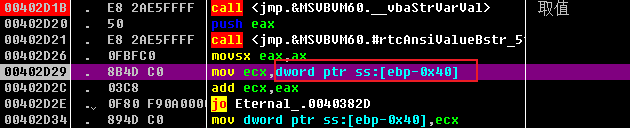

由于上面的cmp比对的是两个字符串的ascii和，因此就直接用了它的字符串，那和肯定是一致的。

正准备过了这个check往下继续，然后......然后就过了，不是，那你最后那个cmp在c啥东西啊？！


狗b vb给爷恶心完了。


```python
def crackme38():
    add_num = [0x52, 0x65, 0x76, 0x65, 0x72, 0x73, 0x65]
    # Reverse
    for num in add_num:
        print(chr(num))
```


## 039-eKH.1

说实话，这题挺普通的，本来有点懒得写在文档里的。但是啊但是，妈个鸡，看上面的38题就是一肚子气。来vb，睁大你的狗眼看看一页写完input和check的含金量，不会写编译器就别寄吧写啊nmd。


人家就是调了两个函数来做check都他妈看的比你舒服多了。

这题除了常规的分析外有一点感觉比较有意思的，这里把用户名变形后的字符串和输入的序列号一起放进去了，一般来讲就该结束了。


但在主函数里决定成功和失败的cmp里面可以看到，最后call出来的结果是0x12D691这么一个数，比的更是一个0xBC614E，刚开始我以为是还需要把变形字符串和序列号进一步组合。


但是，就在上面截的图里发现这两个数其实出现过，这就不太对劲了，这个硬赋值的行为基本可以视为作者想在cmp处误导我们，这个call实际上就是一个字符串比较的call。


进去一看，确实，一个超级大跳跳到函数结尾，太长就不截了。vb你来看看，人故意恶心人也就跳这么长，你什么寄吧东西。


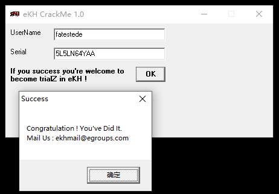

```python
def crackme39():
    name = 'wa1ex'
    table1 = 'LANNYDIBANDINGINANAKEKHYANGNGENTOT'
    serial = ''
    ebx = 0
    for i in range(0, len(name)):
        ebx += ord(name[i])
        ebx *= 256
        if ebx > 2 ** 32:
            ebx %= 2 ** 32
        edx = ord(table1[i])
        ebx |= edx
        if ebx >> 31:
            edx = 0x100000000 - ebx
            ebx = edx
    ebx ^= 0x12345678
    print(hex(ebx))
    table2 = 'LANNY5646521'
    while ebx:
        edx = ebx % 10
        ebx //= 10
        serial += table2[edx]
    print(serial)
```


## 040-DaNiEl-RJ.1

温和到异常的题目


```python
def crackme40():
    name = 'wa1ex'
    serial = ''
    for i in name:
        serial += chr(ord(i) + 5)
    print(serial)
```


## 041-DaNiEl-RJ.1

程序首先要我们拥有一个reg.dat文件，但好像没啥特别的用处，写了字符串进去也不见读。

调了一会没什么进展，主要问题在于虽然字符串搜索是搜到东西了，但是这玩意的函数是单独拎出来的根本进不去，也没啥用。看了眼ede的文档，发现自己忘了这是个delphi程序，可以用之前视频里的工具分析。

过程界面如下所示：Edit有4个，并且都有PROC_00437D1C的调用，那Edit1-4应该就对应调整serial的四个框，PROC_00437D1C就应该是check函数。


嘿，还真是。

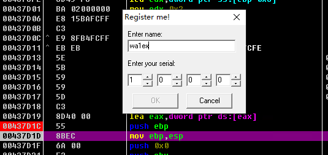

这边是在根据窗口编号取值，不知道为啥取值都是分开来写的。


发现好像四个框的数都写到了内存的同一个位置，我以为会写在四个位置保存再做验证。

 

因此在这个位置打了断点，查看后续调用，如下


这段直接F8，两个retn之后到了这里，进437DD3的call，里面就是验证算法。


简而言之，是字符串1、3、4、5位的ascii值除以10的商，这个商如果大于10，那就再来一次。

看了ede的文档回头再来看这道题，应该说我的解法非常繁琐，主要表现在：在定位到了输入框输入的位置后，我直接在内存里打了断点，这会导致一个后果：虽然程序一定会调用这个位置，但我们并不清楚它是如何调用、在哪调用的，没准只是把它挪了个位置，而我们又再次失去了清晰的思路，这只会加大我们理解的难度，应该属于不得已而为之的办法。

对这道题而言，在四个输入框有值改变时，我应该意识到后续会调用同一个check函数来验证serial是否正确，而不是急着去看写入的值在哪些地方被调用，这反而花了我更多的时间去追溯check函数的位置。

  

```
def crackme41():
    name = 'wa1ex'
    for i in range(0, 5):
        if i == 1:
            continue
        serial = ord(name[i])
        serial = serial // 0xA
        if serial >= 0xA:
            serial = serial // 0xA
        print(serial)
```


## 042-crackme

直接改这个eax的值，鉴定为寄。


找到函数头4010BE下断点开调，文件内容读到了19F8E9处。


算法部分不长，但全是微调，开始折磨，一点点来吧。


边看算法边写注册机，算法的细节就不在这写了，操作不少不过也大多是常规操作，就是发现这算法尤其钟爱前三个字符，跳转的要求就是变形后前三个字符相乘等于0x2A8BF4


这里我硬来了个三重循环，好消息是把符合条件的开头跑出来了，坏消息是跳转之后程序没了。

```
### 0Tb 0uC
result = 0x2A8BF4
for i in range(0x21, 0x7E):
    for j in range(0x21, 0x7E):
        for k in range(0x21, 0x7E):
            if (i ^ len(serial) ^ 0x54 ^ 0x1e) * (j ^ len(serial) ^ 0xbf ^ 0x4d) * (k ^ len(serial) ^ 0xa2 ^ 0x47)==result:
                print(chr(i)+chr(j)+chr(k))
```


而且还有一个问题，下面这段给出了跳出循环的条件，但问题在于我并不知道它到底是什么时候跳出来的（输入里完全没有0xFF相关），给了白给。


从跳转之后继续往下看，发现要求变形后的字符有个0x20才能跳出来


我把第四个字符构造成0x20继续往下

```
    # 手动订了一个0x20 D
    # print(chr(0x20 ^ ord(serial2[0]) ^ len(serial)))
    # 0TbD23456789
```

这里把0x20后的东西继续搬到了其他地方。


然后不出预料的在call esi的地方寄掉了。


这个地方如ede文档所言，call esi意味着这段地址应该是一个函数的开头，而函数的开头是固定的558BEC，他们的乘积也是0x2A8BF4。这下子思路就很清晰了，首先构造变形后的558BEC20，然后按ede文档所给信息尝试在0x20后面直接构造个用户名出来。

寄吧，过是过了，但是一坨用户名。


整理了一下思路，发现是把顺序逆过来的时候有的过程没完全逆过来，逆了但是没完全逆；此外前三个字节与405030处已有的数据进行异或，用户名实际上与405030处的后续字节是无关的，这里写昏头有点混淆了。主要是这题顺着理了太多次思路，一下子转不过来弯了，害死人。

最后补一句，以后写这种读文件类型的题目的时候代码少用字符串，鬼知道它是不是可见字符，md写个文件要用winhex也是没谁了。


```python
def crackme42():
    # 75 52 78
    # 75 83 41
    # serial = '0TbD23456789'
    # print(hex(0x55 * 0x8B * 0xEC))
    # 遍历符合条件的前三个字节
    # result = 0x2A8BF4
    # for i in range(0x21, 0x7E):
    #     for j in range(0x21, 0x7E):
    #         for k in range(0x21, 0x7E):
    #             if (i ^ len(serial) ^ 0x54 ^ 0x1e) * (j ^ len(serial) ^ 0xbf ^ 0x4d) * (k ^ len(serial) ^ 0xa2 ^ 0x47)==result:
    #                 print(chr(i)+chr(j)+chr(k))
    # 算法变形
    # serial1 = ''
    # for i in serial:
    #     serial1 += chr(ord(i) ^ len(serial))
    # serial2 = ''
    # serial2 += chr(ord(serial1[0]) ^ 0x54)
    # serial2 += chr(ord(serial1[1]) ^ 0x4D)
    # serial2 += chr(ord(serial1[2]) ^ 0x47)
    # serial2 = serial2 + serial1[3:]
    # print(serial2)
    #
    # esi = edi = 3
    # # 手动订了一个0x20 D
    # # print(chr(0x20 ^ ord(serial2[0]) ^ len(serial)))
    # # 0TbD23456789
    # while esi < len(serial):
    #     dl = ord(serial2[0])
    #     eax = esi + 1
    #     esi += edi
    #     serial2 = serial2[0:eax-1] + chr(ord(serial2[eax-1]) ^ dl) + serial2[eax:]
    #     dl = ord(serial2[1])
    #     serial2 = serial2[0:eax] + chr(ord(serial2[eax]) ^ dl) + serial2[eax+1:]
    #     dl = ord(serial2[2])
    #     serial2 = serial2[0:eax+1] + chr(ord(serial2[eax+1]) ^ dl) + serial2[eax + 2:]
    # print(hex(ord((serial2[3]))))
    # print(serial2)
    # member_405030 = [0x1e, 0xbf, 0xa2]
    # for i in range(0, len(member_405030)):
    #     member_405030[i] ^= ord(serial2[i])
    # total = 1
    # for i in member_405030:
    #     total *= i
    # print(hex(total))

    serial_len = 9
    result = [0x55, 0x8B, 0xEC, 0x00, 0x77, 0x61, 0x31, 0x65, 0x78]
    result[0] = result[0] ^ 0x1E
    result[1] = result[1] ^ 0xBF
    result[2] = result[2] ^ 0xA2
    print(result[0], result[1], result[2])
    result[3] = result[0] ^ 0x20
    for i in range(4, serial_len):
        if i % 3 == 1:
            result[i] ^= result[1]
        elif i % 3 == 2:
            result[i] ^= result[2]
        else:
            result[i] ^= result[0]
    result[0] = result[0] ^ 0x54
    result[1] = result[1] ^ 0x4D
    result[2] = result[2] ^ 0x47
    for i in range(0, serial_len):
        result[i] ^= serial_len
    for i in result:
        print(hex(i))
```


## 043-riijj_cm_20041121

双击打得开，PE INFO也很正常。


但是扔进ollydebug里一跑就死，我正纳闷呢，直到看见了下面这个函数。


很眼熟，感谢你ede，下一题。


## 044-tsrh-crackme

je改jmp，kill this nig！


搜不到字符串，而且发现好多地方都有Invalid serial，并且调试的过程很怪，尝试打断点用来定位的一个函数重复了好多遍，甚至感觉有地方监控鼠标操作（F9到动不了，挪挪鼠标又能F9了）

往下翻了翻程序，发现了从输入框读取的函数。


顺着往下走，要进两个call，第一个的效果是根据用户名进行初始变换和一个字符串的格式化，得到中间字符串；第二个call的效果是将中间字符串的部分字符取出来继续变形（说实话，就取了一个字符，这么大费周章真的离谱），得到serial

乐，在尝试肥逼ede的时候出错了，再次调试的时候发现中间的数字变了，原来中间的数和用户名长度正相关，调试的时候断点下的位置已经在获取中间数字后面了。


```python
def crackme44():
    print((chr(0x74) + chr(0x73) + chr(0x72) + chr(0x68)))
    name = 'wa1ex'
    middle_num = 2003 + len(name)
    serial = "tsrh-" + str(middle_num) + "-"
    final_serial = 'tsrh-2008-'
    unknow1 = 0x68727374 + 0x3220
    serial_len = len(serial)
    for i in name:
        eax = ord(i) + 0xC
        edx = 2 * eax - 0x11 - serial_len
        eax ^= edx
        serial += hex(eax)[2:4]
        serial_len = len(serial)
    print(serial)
    unknow1 ^= 0x403321
    for i in range(0, len(name)):
        if i == 0:
            serial_index = 0xC
            edx = ord(serial[serial_index])
        else:
            edx = 0x0
        eax = ord(name[i]) + 1
        eax ^= edx
        while eax < 0x41:
            eax += 0x8
        while eax > 0x5A:
            eax -= 0x3
        final_serial += chr(eax)
    print(final_serial)
```


## 045-CyTom-crackme

搜索字符串发现在函数里面，想办法跳出去。

在这里第一次看到输入，那就去41231A看下。


~~可以看到这个cmp基本就应该是我们的目标了，但是还是没找到切入点，试试之前的工具（乐，不支持delphi2程序，拉倒）~~ 哈哈，错误的。

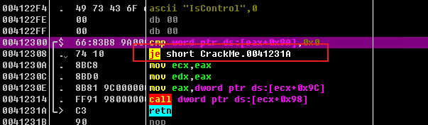

刚刚搜的是失败字符串，搜了下成功的，发现了他妈新大陆。比较离谱的是我想复现一下之前是咋搜出来字符串在函数里的，结果没复现出来，乐了。


1E240 好熟悉的数，想了一下，惊觉是123456的十六进制。太棒了，不用进函数了。


然后进下一个call就结束了。

？

就结束了？这年头竟然还有这么朴实无华、毫不做作的题目？

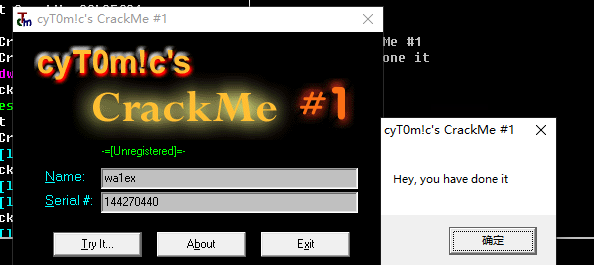

```python
def crackme45():
    name = 'wa1ex'
    result = 1
    for i in name:
        result = (result * ord(i)) & 0xFFFFFFFF
    result &= 0xFFFFFFF
    print(result)
```


## 046-keyme1

难得碰到了一个加完壳不需要重建导入表的。

草，沙雕题目。从scanf到cmp就两行，还是硬编码。


## 047-surre

很抽象的题目，我点try it他要我选一个文件，但我没找到它指定的文件类型。

所以尝试着给了个1.txt，内容为123456。坏消息：我还是不知道它在哪读的，好消息：它还真能读

由于cmp的条件是ebx，特别关注ebx


这一段就实现了个输入数的ascii累加


下一个call的内容很奇怪，因为我在关注ebx的动向，而这个call相当于没动ebx。那我直接构造一个叠加为0x20A9的字符串试试


加完了。


```python
def crackme47():
    serial = 'wa1exzzzzzzzzzzzzzzzzzzzzzzzzzzzzzzzzzzzzzzzzzzzzzzzzzzzzzzzzzzzzzzzzC'
    total = 0
    for i in serial:
        total += ord(i)
    print(hex(total))
    print(chr(0x20A9-0x2066))
```


## 048-monkeycrackme1

有两个valid key，点进去一看是在一段里的，在函数头下断点。


中间的call就是变形函数。


这种不好好存读数据的代码是真恶心，byd全从栈上读，malloc不会写是把。


```python
def crackme48():
    name = 'wa1ex'
    arg1 = 0x4DE1
    serial = ''
    for i in name:
        al = ord(i)
        al ^= (arg1 >> 8)
        serial += hex(al)[2:4].upper()
        al += arg1
        al = (al * 0xCE6D) & 0xFFFF
        al = (al + 0x58BF) & 0xFFFF
        arg1 = al
    print(serial)
```


## 049-THraw-crackme8

没仔细看代码，先猜一个0+ascii


蚌埠住了。


```
def crackme49():
    name = 'fatestede'
    serial = '0'
    for i in name:
        serial += hex(ord(i))[2:4]
    print(serial)
```


## 050-daxxor

令人怀念的Dev-C++


草了，这是什么沙雕东西，可以和48题pk一下逆天程度了。


看的想吐，算法代码有大量重复的这玩意视觉污染，更搞笑的是他把单字符的ascii取出来之后：

1、+8（用户名长度），替换原字符

2、-4

3、-8（用户名长度）

4、-2

5、+2

行，-4。不是，有病是吧，有病就治啊。


底下更是重量级，3个字符后加个-，5个字符后再加个-，6个字符后加axd的效果，能写成这种样子。


评价为堪称vb。


```python
def crackme50():
    name = 'wwwwwa1ex'
    serial = ''
    for i in name:
        serial += chr(ord(i)-4)
    serial = serial[0:3] + '-' + serial[3] + '-axd' + serial[4:]
    print(serial)
```


## 051-Keygenning4newbies

显然，得：


```python
def crackme51():
    name = 'wa1ex'
    ecx = 0
    serial = 0
    eax = 0
    for i in name:
        ecx += 1
        eax = ord(i) ^ ecx
        serial += eax
    eax *= 0x6
    serial <<= 0x7
    eax += serial
    print(hex(eax).upper()[2:])
```


## 052-tc.2

上来需要导入一个文件，需要文件内容为Runtime Error: 12FF:024，check部分如下图。但令人悲伤的是，我一开始以为这地方是个什么我不知道的运行报错，完全没想到这玩意就是导入文件需要的内容，导致我白白定位了半天，还是看了ede的文档才尝试了一下。

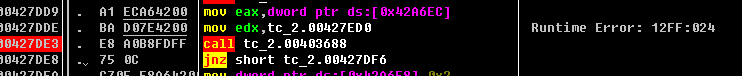

尝试跟了一下流程，有点长到令人发指的感觉，中间调用了很多次用户名不说，还有非常非常多看不出来作用的call，每个都跟进去怕是要死人。不过先试一下吧。


变形个寂寞，实际上是用来记录每个字符的位置，我直接问号。


这里拼了个字符串出来


真正的变形部分


细看一下变形部分，有个地方很搞笑。框的这两个地方是栈的同一个位置，但编译器用两种方式解释了。

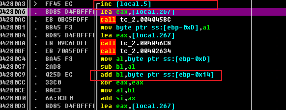

尾声


评价：算法很简单，但是程序写的和屎一样，不是vb胜似vb。首先，上一个变量还在local5，下一个就敢在local267，强行要求破解者要lock stack之后不停的跟才能了解发生了什么；其次，函数中有大量的无效部分，不管是记录字符位置还是拼接字符串，和真正的变形部分没有丝毫关系，而破解者因为上一条的原因还不敢一路F8；连编译器都没认出来用的是同一个变量，很难想象作者在调用的时候是用了什么恶心人的方式来调用的，纯恶心人。


```python
def crackme52():
    name = 'wa1ex'
    total = 0
    bl = 0
    ebp_014 = 1
    for i in name:
        if bl < ord(i):
            bl = 0x100 + bl - ord(i)
        else:
            bl -= ord(i)
        bl += ebp_014
        total += bl
        ebp_014 += 1
        print(hex(total))
    if total < 0x438D:
        total += 0x45E6
    print(str(total)[0:2] + '-' + str(total)[2:3] + '-' + str(total)[3:])
```


## 053-devilz KeyGen me#3

很嚣张的题目，上来就要求我自杀。妈的，爆了！


但是好像用没见过的方式加了壳，这下似定了。

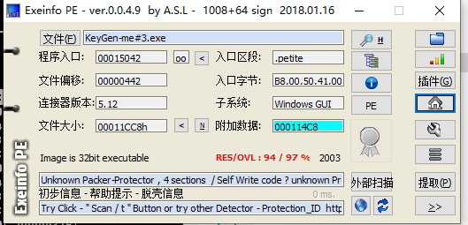

打开程序发现有pushad，找popad下断点，但是没断着。


看视频使用esp定律在401000处脱壳，现在可以搜索到字符串了。算法很简单。


```python
def crackme53():
    name = 'wa1ex'
    name_new1 = ''
    for i in range(0, 5):
        name_new1 += name[4-i]
    name_new2 = ''
    for i in range(0, 5):
        name_new2 += chr(ord(name_new1[i]) ^ 0x30 ^ 0x20)
    print(name_new2)
```


## 054-vcrkme01

跳到开头变形。


说起来刚开始以为是个硬编码，试了两下发现还不是。

第二个字符为-


有个挺有意思的写法：下面的ecx的值实际上为字符串的长度，就是把这玩意放在循环里有点多此一举的意思。

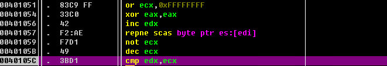

代码很长，但是有很多冗余信息，好在看着没有vb和前面有些题那么反人类


```python
def crackme54():
    name = 'f-atestede'
    ebp = 0
    for i in name:
        ebp += ord(i)
    ebp += 0x6064
    sebp = str(ebp)
    ebp += 0x6064
    temp = name[0:2] + name[-1].upper() + sebp + '-' + str(ebp)
    print(temp)
```


## 055-BCG Crackme

一点开来阵仗还不小，有点意思。ESP脱壳。

文件名。


分两次读了10个字符


要求字符串1异或0x58后等于字符串2，看起来是很简单事，但是问题在于4020F3和4020FD这个尴尬的位置。没错，正常写入20个字符将导致字符串1的长度为20，字符串2的长度为10，等于是不可能等于的，这辈子都等于不了了。


根据读取逻辑和判断逻辑，因此把前10个字符设成0x58，后10个字符设成0x0即可，具体条件为：

1、要断开两个字符串，因此第11个字符必为0，也就是说第1个字符必为0x58

2、由于在异或过程中会与0x0进行cmp，因此0x0不能出现在前10个字符中。

3、满足前两个条件后，对应字符异或对应值为0x58即可。

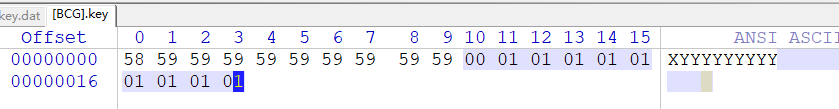


令人唏嘘，这个web已经打不开咯。


## 056-diablo2oo2's Crackme 01

不难，很烦，真的很烦。


```python
def crackme56():
    name = 'wa1ex'
    serial_list = []
    serial = ''
    al = 0x5
    for i in name:
        cl = (ord(i) ^ 0x29) + al
        if (cl > 0x5A) | (cl < 0x41):
            cl = 0x52 + al
            serial_list.append(hex(cl))
        else:
            serial_list.append(hex(cl))
        al -= 1
    al = 0x5
    for i in name:
        cl = (ord(i) ^ 0x27) + al + 0x1
        if (cl > 0x5A) | (cl < 0x41):
            cl = 0x4D + al
            serial_list.append(hex(cl))
        else:
            serial_list.append(hex(cl))
        al -= 1
    for i in serial_list:
        serial += chr(eval(i))
    print(serial)
    cl = 0
    serial1 = ''
    for i in serial:
        dl = ord(i) + 5
        if dl > 0x5A:
            dl -= 0xD
        dl ^= 0xC
        if dl < 0x41:
            dl = 0x4B + cl
        if dl > 0x5A:
            dl = 0x4B - cl
        cl += 1
        serial1 += chr(dl)
    print(serial1)
```


## 057-bbbs-crackme04

我超，这次是真的反调试？哦，不是。

视频片段里的代码和我的好像对不上？怪事。b站也有类似评论，暂时搁置。


## 058-CZG-crackme1

没找到可用的字符串我靠。

尝试直接从头F8，还行不是很远。上面的call有输入，下面的call直接没了，猜测输入和算法都在上面的call里。


寄，完全没找到算法就寄了。

看了眼视频，完全没注意到这两个东西，但尝试了一下仍然没有思路。


再看一眼视频，原来定位的关键是算法字符串，行吧。

真是有被这下头题目恶心到，算法巴拉巴拉调半天，卡在这个位置，实在是想不通格式化是咋把用户名格过来的。


看了眼视频，nm原来和地址内存的数据无关，只和地址本身有关。


```python
def crackme58():
    # name = 'wa1ex'
    # str1 = 'crackme'
    # str2 = '657uthutduehdhdhd,ljhgs4sgf4s5s5gs5sg5g45s4g5dgyshste][gf]fg]f]d]'
    # temp = []
    # for i in range(0, len(name)):
    #     edx = ord(str1[i])
    #     ecx = ord(str2[i])
    #     cal = ecx & edx
    #     cal &= ord(str1[i])
    #     cal ^= ord(str2[i])
    #     cal += i
    #     temp.append(hex(cal))
    # temp.append(hex(len(name)))
    # serial = '0x'
    # for i in temp:
    #     serial += i[2:]
    print(0x423820)
```


## 059-Dope2112.1

普通。


```python
def crackme59():
    name = 'wwa1ex'
    dict_alp = {'a': 0x18, 'e': 0xD, 'w': 0x58, 'x': 0xA}
    total = 0x5D
    for i in range(0, 5):
        if dict_alp.get(name[i]):
            value = dict_alp.get(name[i])
        else:
            value = 0x5D
        total += value
        if total >= 0x100:
            total -= 0x100
    print(str(total) + '-' + str(6 * 0x4A7E))
```


## 060-snake

算法部分被集中在了3个call里面。


第一个call看不懂，往很偏的地方塞了很多FF。


第二个call往一段00里异或了很多CC，这下算是知道这题目为什么叫snake了，99是当前位置，DD猜测是目标位置。


根据第三个call，1往上，2往左，3往右，那剩个0就得是向下了。的位置在99，先尝试挪到DD看看效果。22222000，发现没有成功。原因是进到DD的check流程时，它cmp了401F04处的一个数，观察上下文可以看到这个数会在CC触发的时候dec，也就是说要先把CC吃完，最后吃DD。


（突然感觉这注册机有种任重而道远的感觉。

实现上，我把每次出现的CC点按序存入二维数组，该数组的头尾分别由99点和DD点构成。虽然有考虑过要不要搞得最短距离的实现，但是犯懒就算了。


没想到这注册机连肥逼ede都过了，还行。（吊，写成最快的ede了


最后观察了一下程序运行，还好这玩意没有碰撞体积，不然头更大了。


```python
def crackme60():
    import numpy as np
    np.set_printoptions(linewidth=np.inf)
    area = np.zeros((16, 16)).astype(int)
    name = 'wa1ex'
    PointRecord = np.zeros((2, len(name) + 2)).astype(int)
    serial = ''
    dl = 0
    for i in name:
        dl += ord(i)
        if dl >= 0x100:
            dl -= 0x100
    for i in range(0, len(name)):
        al = ord(name[i])
        al ^= dl
        dl -= al
        if dl < 0:
            dl += 0x100
        area[al // 16][al % 16] ^= 0xCC
        PointRecord[0][i+1] = (al // 16)
        PointRecord[1][i+1] = (al % 16)
        if not area[al // 16][al % 16]:
            dl -= 1
            dl -= al
            if dl < 0:
                dl += 0x100
            area[al // 16][al % 16] ^= 0xCC
            PointRecord[0][i] = (al // 16)
            PointRecord[1][i] = (al % 16)
    dl ^= al
    while True:
        al -= dl
        if al < 0:
            al += 0x100
        if area[al // 16][al % 16] != 0xCC:
            break
        dl -= 1
    area[al // 16][al % 16] = 0xDD
    PointRecord[0][len(name) + 1] = (al // 16)
    PointRecord[1][len(name) + 1] = (al % 16)
    al = dl
    while True:
        if (area[al // 16][al % 16] != 0xCC) and (area[al // 16][al % 16] != 0xDD):
            area[al // 16][al % 16] = 0x99
            break
        else:
            al -= 1
    PointRecord[0][0] = (al // 16)
    PointRecord[1][0] = (al % 16)
    for i in range(0, len(name) + 1):
        line_distance = PointRecord[1][i] - PointRecord[1][i+1]
        row_distance = PointRecord[0][i] - PointRecord[0][i+1]
        if line_distance > 0:
            serial += '2' * line_distance
        else:
            serial += '3' * (-line_distance)
        if row_distance > 0:
            serial += '1' * row_distance
        else:
            serial += '0' * (-row_distance)
    print(serial)
```


## 061-TDC-keyfileme

一开始有个问题是不知道密钥文件的文件名是什么，但是翻memory address的时候看到了keyfile.dat，试了一下确实是，不管了。


根据hint得知前16位为name，后16位为serial。然后这个40113E的位置就该是算法call。


用00作为文件长度的填充，也作为字符串读取的终止符，使serial匹配。


```python
def crackme61():
    name = 'wa1ex'
    name = name + (16 - len(name)) * '1'
    ebx = 0
    for i in name:
        eax = ord(i)
        eax += 0xF
        eax ^= 0x20
        ebx += eax
        print(hex(ebx))
    ebx = ebx * 0x7A69
    print(name + hex(ebx)[2:].upper())
```


## 062-syllogism-crackme1

要求用户名和这个字符串完全一致？？好像没有这么单纯。


这题的代码突出一个怪，de起来及其的不顺手，但又不是像vb一样的一眼屎，很怪。追记：太傻比了，作者加的屎。

在这两个call里面把用户名的第一个字符变成了空格，然后和serial进行比较。


如果完全一致，就会给bl赋个1。


那么问题来了，后面这一大段+特定字符串有什么用呢？


事实上p用没有的同时，还让我绕了20min弯路。就像我在这题开头所说的，我第一时间以为这个字符串会对验证过程有很大影响，甚至说需要输入的用户名和该字符串完全一致。但就在这个地方作者打了个反思路，如果输入的字符串和该字符串完全一致，那么验证将不通过。没错，你输入的所有用户名、序列号都能通过这个call，**除了**这个字符串。诶好死不死我还正好就输了这个字符串，嗨呀我是真的rlnmd。

最后精心保存下来的bl赋值给了al，让test eax eax在jmz处不跳转，然后就过了。


## 063-dc0de-crackme

一种植物，63之前写的没保存下来，淦，正好从头来一遍吧，这次记得不要写字符串了。

评价还是为：不难，很烦。


```python
def crackme63():
    name = 'wa1ex'
    hard_str1 = ';;;;;;;;;;;;;**====,,=,,========*=**=*=**=*=**=*=*=* '
    hard_str2 = ''
    for i in hard_str1:
        hard_str2 += chr(ord(i)+1)
    local4 = len(hard_str2) + 2
    hardcode_name = []
    for i in hard_str2:
        hardcode_name.append(ord(i))
    hardcode_name.append(0)
    for i in name:
        hardcode_name.append(ord(i))
    hardcode_name.append(0)

    for i in range(0, 100):
        ecx = hardcode_name[i]
        if ecx > 0x3C:
            if ecx == 0x3e:
                local4 += 1
            elif ecx == 0x5B:
                ecx = local4
                if hardcode_name[ecx-1]:
                    continue
                else:
                    i += 1
                    while True:
                        if hardcode_name[i] == 0x5D:
                            break
                        else:
                            i += 1
                            continue
            elif ecx == 0x5D:
                ecx = local4
                if hardcode_name[ecx-1]:
                    continue
                else:
                    i -= 1
                    while True:
                        if hardcode_name[i] == 0x5D:
                            break
                        else:
                            i -= 1
                            continue
        elif ecx == 0x3c:
            local4 -= 1
        elif ecx == 0x21:
            break
        elif ecx == 0x2B:
            ecx = local4
            hardcode_name[ecx-1] += 1
        elif ecx == 0x2D:
            ecx = local4
            hardcode_name[ecx-1] -= 1
    edi = 0x19f568
    for i in range(1, 10):
        eax = len(hard_str2) + i
        try:
            eax = hardcode_name[eax-1]
        except IndexError as e:
            continue
        edi += eax
    print(edi)
```


## 064-CR-Game0.7

7个level太多了，先放着，下一题。


## 065-Eternal Bliss

草，VB。

真是个一眼万年的崽种。


得，连在哪读的serial都没找到。

虽然有一堆的跳转，但每次都在第一个就跳了。


后面发现是在4037D1这个地方跳了正确的跳转。


看了眼视频，用VB Decompiler进行反编译就能看到序列号（好抽象

投降投降，尬题。


## 066-Andrnalin.3

使用VB Decompiler


然后我gpt了一下，居然连逆向过程都能找到，有点离谱。


不过让他直接给结果的时候是给错了。


debug了一下，变形的过程确实只是每个字符加了0x0A。


```python
def crackme66():
    hard_str = 'kXy^rO|*yXo*m\kMuOn*+'
    serial = ''
    for i in hard_str:
        serial += chr(ord(i)-10)
    print(serial)
```


## 067-CarLitoZ.1

怎么还是VB？？这次有点抽象了，不太直观。


在od里跟了一圈人晕了，看视频学习一下。

vb decompiler分析得serial为8位，且字符串应该贼长。


ctrl + g到赋值的地方看看，发现call之后栈上出现了字符串。


follow dump看字符串，串之大，一图截不下。然后视频还介绍了该程序是如何根据dat文件内容判断当前注册状态的，不过很简单，就不放在这里说了。


因为是固定字符串取某几位这种操作，那就不写注册机直接给结论了。vb编译器是vb程序最好的保护伞。


```
rkh1oyie
```


## 068-figugegl.3

感动，终于不是vb了。尝试了一下，没好到哪里去，完全搜不到字符串，看得到搜不到~


跑了一遍之后又能搜到了（？


找到Success部分，发现了获取文本框输入的函数。

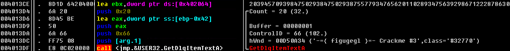

终。


```python
def crackme68():
    hard_str = '203945709398475029384750293875577934765620110289347563929867122287863095762304984875020398746563'
    name = 'wwa1ex'
    serial = ''
    for i in name:
        edx = ord(i) - 0x20
        serial += hard_str[edx]
    print(serial)
```


## 069-ArturDents-CrackMe#4


```python
def crackme69():
    name = 'wa1ex'
    serial = ''
    for i in name:
        esi = ord(i)
        ecx = 0x6
        eax = esi//ecx
        edx = esi
        edx >>= 0x2
        eax *= edx
        temp = eax

        ecx = 0xA
        edx = esi//ecx
        eax = temp
        result = eax//edx
        serial += str(result)
    print('ADCM4-' + serial + '-YEAH!')
```


## 070-CodeFantasy-crackme

题目说自己很简单，观望一下。

确实简单，硬编码。


## 071-Rith.1

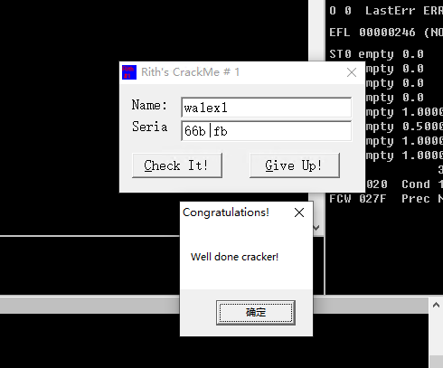

```python
def crackme71():
    name = 'wa1ex1'
    hardcode = '31415926535897932384'
    serial = ''
    eax = 0
    for i in range(0, len(name)):
        al = ord(name[i])
        ebp = ord(hardcode[i])
        edx = al % ebp
        eax = edx * 2
        if eax > 0x7B:
            eax -= 0x1A
        if eax < 0x41:
            edx = 0x82
            edx -= eax
            eax = edx
        if (eax > 0x5B) and (eax < 0x61):
            eax = eax % 10 + 0x30
        serial += chr(eax)
    print(serial)
```


## 072-Lesco_crackme01

这题有点搞，有两个验证逻辑，而且有一个放在了"正确"的messagebox里面。


很离谱。


由于第一个验证逻辑的调用的MessageBoxA总会走到MessageBoxExA，所以第一个对不对应该是无所谓的。

其实在写完上面内容之后，我有个问题就是：它到底在什么地方压进了messagebox的参数，没看到和弹窗字符串一致的信息。今天再看的时候发现注释里标的完全是个误导项，传参的地方就是这里。沿着4034F8往上发现这两个字符串居然是一个字符一个字符拼出来的，真是难为他了。


```python
def crackme72():
    name = 'wa1ex'
    # 假
    pos_4038FC = len(name)
    serial = ''
    for i in range(0, len(name) + 1):
        ecx = (pos_4038FC * (i+1) + 0x17) ^ 0xF
        eax = ecx
        serial += str(eax)
    print(serial)
    # 真
    serial = ''
    ax = ((ord(name[1]) << 8) + ord(name[0])) ^ 0xE32F
    ax = (ax * ax) & 0xFFFF
    ax ^= 0xAB6C
    cx = 0
    bx = 0
    for i in name:
        stack_eax = ax
        stack_ecx = cx
        dx = ord(i)
        cx = ax % 0x100
        dx = (dx * cx) & 0xFFFF
        cx = ax // 0x100
        dx = (dx * cx) & 0xFFFF
        cx = stack_ecx
        dx ^= 0x45EB
        dx >>= 2
        dx += dx
        cx += 1
        stack_edx = dx
        stack_eax = ax
        stack_ebx = bx
        ax = cx
        ebx = 0x2
        dx = ax % ebx
        ax //= ebx
        bx = stack_ebx
        ax = stack_eax
        flag = dx
        dx = stack_edx
        if flag:
            serial += hex(dx)[2:].lower()
        else:
            serial += hex(dx)[2:].upper()
    print(serial)
```


## 073-abexcrackme3

创建一个内容为18个字符的abex.l2c文件。？


## 074-Cosh.1

在je的地方下了个断点给我干懵了，不知道为啥函数头没断下来。

调了一下发现是这里call过来的


继续下断点，发现在点check的时候，eax的值是401207，这个位置已经在函数头下面了。那确实断不到。

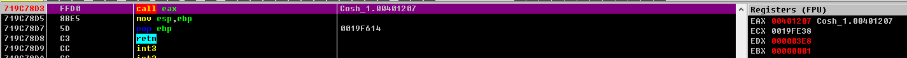


看了一下，应该是要在U盘里读文件，摆了。


## 075-blaster99

爆破方式需要看一下，有点蒙住了。

注册机就是硬编码`2G83G35Hs2`。


## 076-ArturDents-CrackMe#1

这？


## 077-BuLLeT.8

看着贼怪，感觉有壳，根据esp定律脱壳。

下不到合适的断点位置，估摸着要用dephi特攻程序了。
